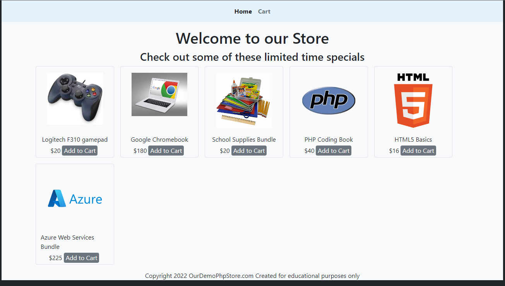
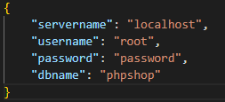

# PHP Shop
Example of an e-store using php and mysql

## Dynamic Shop
Items are loaded into the shop from the database table "shop". Images are stored in the `/shop/img` folder while the path is stored in shop.Image

## Session based Cart
The shopping cart uses sessions to keep track of items in cart.

### Setup
1. download and extract files
2. import `/shop/shop.sql` table into sql database
3. set the proper details in `/json/mysql.json`  

